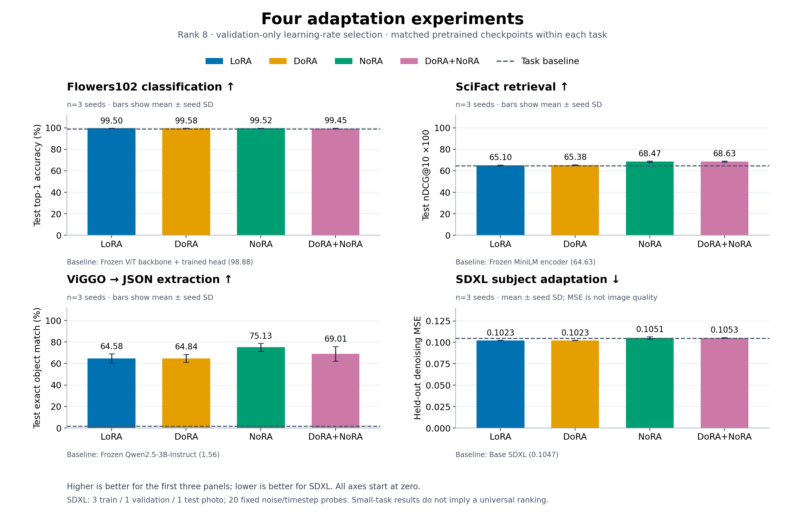
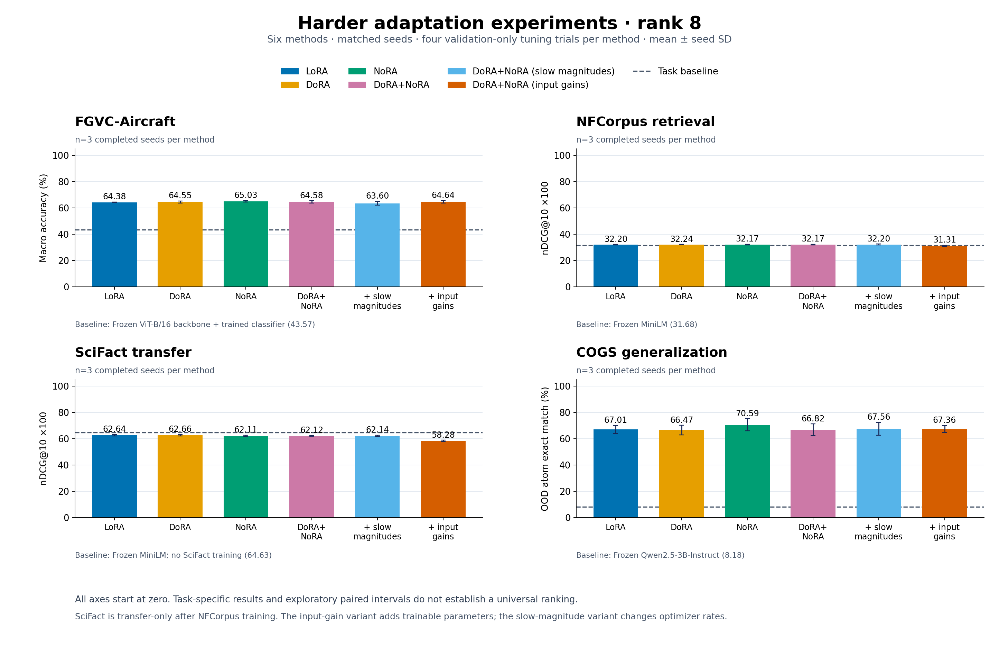

# DoRA

A small PyTorch implementation of [DoRA: Weight-Decomposed Low-Rank Adaptation](https://arxiv.org/abs/2402.09353) (Liu et al., 2024).

For a PyTorch linear weight `W` of shape `[out_features, in_features]`, the adapted weight is

```text
V = W + A @ B
W_adapted = m * V / stop_gradient(row_norm(V))
y = linear(x, W_adapted, bias)
```

There is one trainable magnitude per **output**, with `m.shape == (out_features, 1)`. The denominator is detached as in the paper's memory-efficient variant (§4.3), also used by [Hugging Face PEFT](https://github.com/huggingface/peft/blob/main/src/peft/tuners/lora/dora.py). The base weight and bias are frozen. This implementation retains its original factor naming: `A` has shape `[out_features, rank]`, `B` has shape `[rank, in_features]`, and the update has implicit scaling 1.

## Usage

```bash
python -m pip install -r requirements.txt
python dora.py
python -m unittest -v test_dora
```

```python
import torch
from torch import nn
from dora import DoRALayer, replace_linear_with_dora

base = nn.Linear(128, 64)
layer = DoRALayer.from_linear(base, rank=8)
# The initial adapter preserves base(x), including its bias.
x = torch.randn(16, 128)
torch.testing.assert_close(layer(x), base(x))

model = nn.Sequential(nn.Linear(128, 64), nn.ReLU(), nn.Linear(64, 16))
model = replace_linear_with_dora(model, rank=8)
optimizer = torch.optim.AdamW(
    (p for p in model.parameters() if p.requires_grad), lr=1e-3
)

# After fine-tuning, export an independent frozen Linear for inference.
merged = layer.eval().to_linear()
torch.testing.assert_close(merged(x), layer(x))
```

Always use the return value of `replace_linear_with_dora`: the root itself may be a linear layer. Nested modules and shared module aliases are supported. Conversion copies the source tensors and preserves device, weight dtype, bias presence, and training/evaluation mode. Parameters in other kinds of layers keep their existing `requires_grad` settings; freeze those separately if needed. Distinct linear modules with tied weight parameters receive independent copies. Recreate the optimizer after conversion.

`DoRALayer(d_in, d_out, rank=4)` also works directly: it initializes a frozen base weight like `nn.Linear` and has no bias unless a bias tensor is supplied. This is primarily an adapter for pretrained weights.

Move the base layer to its intended **device and dtype before wrapping it**. Norms and initial magnitude parameters use FP32, and magnitude rescaling occurs before casting activations back. Initializing magnitudes on CPU and then moving the adapter to GPU can introduce small norm-reduction differences that affect BF16 rounding. Calling `.half()` on the adapter afterward also casts its magnitude parameter under normal PyTorch behavior. Zero norms and initial magnitudes use the same small positive floor, preserving initial outputs while allowing zero rows to learn. Extreme values can still overflow or underflow during ordinary floating-point norm reductions; this implementation targets ordinary pretrained weight ranges. Merged and factorized outputs can differ slightly due to floating-point evaluation order.

## Corrections and validation

The original code normalized `dim=0` even though PyTorch stores transposed linear weights. Its one-output demo consequently reduced direction adaptation to elementwise signs, with nearly zero direction gradients. This version normalizes `dim=1`, detaches the denominator, initializes standalone weights, handles missing biases, and avoids resetting the caller's RNG on import. **Old adapter checkpoints are incompatible with the corrected magnitude layout.**

The 20 tests cover an independent dense forward/gradient reference with nonzero adapters, conversion identity, frozen base weights, optimizer updates, root/shared module conversion, state dictionaries, merged inference, zero/tiny weights, CPU/CUDA execution, autocast, and FP16 overflow regressions. They passed locally with PyTorch 2.12.0+cu130, including FP32, FP64, FP16 and BF16 checks.

The demo evaluates the same held-out dataset before and after adaptation and checks conversion identity. A seeded local run produced:

```text
Total Parameters: 11
Trainable Parameters: 11
Final Evaluation Loss: 0.15444783866405487
Total Parameters: 56
Trainable Parameters: 45
Continuing training with DoRA layers...
Final (DoRA) Evaluation Loss: 0.08973299711942673
```

This synthetic example is a smoke test, not a model-quality benchmark. Exact losses can vary by PyTorch version and hardware.

## Performance

Training applies the low-rank update to activations, keeping the dense adapted weight out of the backward graph. The row norm still requires a dense temporary, computed without autograd and reused for the base-weight addition. `to_linear()` folds the adapter into a plain frozen linear layer for inference, eliminating ongoing adapter overhead; the export is a snapshot and does not track later training updates.

The benchmark compares against a **corrected dense DoRA reference**, validates outputs and input/adapter gradients first, and saves raw timings, peak incremental CUDA allocations, source hashes, seed, commands, and environment details:

```bash
python benchmark_dora.py --device cuda:0 --output benchmark_1024.json
python benchmark_dora.py --device cuda:0 --in-features 4096 --out-features 4096 \
    --tokens 32 --output benchmark_4096.json
```

Timing includes synchronized forward/backward calls but excludes optimizer steps. Merged inference excludes one-time export cost. Performance depends on matrix size and batch size; extra kernel launches can make factorization slower for small layers.

Measured on an NVIDIA RTX PRO 6000 Blackwell Max-Q with PyTorch 2.12.0+cu130, FP32, rank 8 (median of seven samples, 20 calls per sample):

| Weight / tokens | Dense forward + backward | Factorized forward + backward | Dense / factorized peak allocation |
| --- | ---: | ---: | ---: |
| 1024 × 1024 / 32 | 0.203 ms | 0.250 ms | 16.1 / 4.0 MiB |
| 1024 × 1024 / 256 | 0.204 ms | 0.259 ms | 17.0 / 6.0 MiB |
| 4096 × 4096 / 32 | 0.652 ms | 0.256 ms | 256.5 / 64.0 MiB |

The largest case is **2.55× faster with 75% less incremental peak allocation**. Its merged inference takes 0.061 ms versus 0.231 ms for the dense adapter. These allocation figures exclude existing model/input tensors and optimizer state. Small cases favor dense computation for latency. Worst FP32 output/gradient relative-L2 error was 6.2e-7; a separate BF16 smoke check also passed. Full configurations, comparisons, raw timing samples, and provenance are in [benchmark_results.json](benchmark_results.json).

## Real-world task comparisons (2026-10-08)

**NoRA produced the clearest gains on retrieval and JSON extraction.** DoRA had the highest Flowers102 accuracy, with small differences near the task's accuracy ceiling. Combining DoRA and NoRA did not consistently improve on NoRA.

We ran four tasks on this machine's RTX PRO 6000 Blackwell Max-Q GPUs, with **three training seeds per method**, rank 8, matched initializations, and equal validation-only learning-rate searches within each task. These are local, limited-budget comparisons of LoRA, DoRA, [NoRA](https://arxiv.org/abs/2608.31036), and DoRA+NoRA; they do not reproduce the NoRA paper's benchmark scores. Models, data, precision, and commands are in the [experiment protocol](experiments/README.md).

| Method | Flowers102 top-1 % ↑ | SciFact nDCG@10 ×100 ↑ | ViGGO exact match % ↑ | SDXL denoising MSE ↓ |
|:--|--:|--:|--:|--:|
| Task baseline | 98.88 ± 0.12 | 64.63 | 1.56 | 0.1047 |
| LoRA | 99.50 ± 0.02 | 65.10 ± 0.31 | 64.58 ± 4.32 | 0.1023 ± 0.0001 |
| DoRA | 99.58 ± 0.02 | 65.38 ± 0.32 | 64.84 ± 3.77 | 0.1023 ± 0.0001 |
| NoRA | 99.52 ± 0.15 | 68.47 ± 0.62 | 75.13 ± 3.63 | 0.1051 ± 0.0013 |
| DoRA+NoRA | 99.45 ± 0.24 | 68.63 ± 0.48 | 69.01 ± 6.79 | 0.1053 ± 0.0003 |

Adapter values are mean ± sample standard deviation across seeds 42–44. The vision baseline trains only the classifier with the same three seeds; the other baselines are single evaluations of frozen pretrained models. SciFact nDCG is multiplied by 100. SDXL MSE is a denoising objective, **not an image-quality score**.



- **Retrieval:** NoRA improved nDCG@10 by **3.37 points** over LoRA; the exploratory paired-bootstrap 95% interval was **[1.43, 5.32]**. Adding DoRA gave only **0.16 points**, with an interval spanning zero.
- **JSON extraction:** NoRA improved exact match by **10.55 percentage points** over LoRA; the corresponding interval was **[3.13, 18.75]**. DoRA alone showed no clear advantage over LoRA.
- **Vision:** DoRA led LoRA by **0.076 percentage points**. All four adapter methods exceeded 99.4% mean accuracy, leaving little room to distinguish them.
- **SDXL:** LoRA and DoRA were nearly tied on held-out denoising loss. This study used one subject and just **3 train / 1 validation / 1 test photos**. See the [fixed-prompt sample grid](results/2026-10-08/sdxl_samples.jpg) and [separate image diagnostics](results/2026-10-08/sdxl_metrics.md); neither loss nor similarity establishes an overall image-quality winner.

Measured median training time, in seconds:

| Method | Flowers102 train+val (s) | SciFact train (s) | ViGGO train+val (s) | SDXL train (s) |
|:--|--:|--:|--:|--:|
| Task baseline | 29.2 | — | — | — |
| LoRA | 55.0 | 1.6 | 59.2 | 135.8 |
| DoRA | 68.1 | 1.8 | 61.0 | 184.6 |
| NoRA | 55.6 | 1.7 | 59.7 | 180.6 |
| DoRA+NoRA | 68.9 | 1.9 | 61.5 | 229.4 |

Timing excludes downloads, model loading, and test-image/text generation; vision and extraction include validation. DoRA's magnitude scaling and dense weight-norm calculation add training work. Exact timing scopes, trainable-parameter counts, and peak CUDA allocations are retained in the [machine-readable results](results/2026-10-08/summary.json).

The combined core/adapter suite passed **26 tests**. An [independent artifact audit](results/2026-10-08/validation.json) recomputed every reported primary score from saved predictions or noise probes and checked recorded source hashes. [Raw artifacts](results/2026-10-08/raw_artifacts.tar.gz) include predictions, logs, split manifests, and executed source snapshots; [their manifest](results/2026-10-08/raw_manifest.json) records hashes. The [archive-only reproduction command](results/2026-10-08/reproduce.md) rebuilds the tables and chart without downloading models. Checkpoints and full-resolution image sets remain in the local run directories. Three seeds, small evaluation sets, and a two-rate search limit the conclusions; no method is a universal winner.

## Harder tasks and mixture ablations (2026-10-08–09)

**Neither new mixture gives a consistent downstream improvement.** Input gains help many constructed teachers but hurt retrieval transfer; slower magnitudes hurt rank-2 Aircraft accuracy. Ordinary DoRA has a modest rank-2 advantage over LoRA on Aircraft, while its rank-8 method differences remain uncertain.

This round replaces near-ceiling flower classification with fine-grained Aircraft recognition, trains biomedical retrieval with untouched cross-domain transfer, and tests compositional parsing on COGS. A separate controlled-teacher grid probes row magnitudes, input-column amplitudes, and unused rank. We also tested two experimental mixtures: **slower magnitude learning** and **learned input gains**. Protocols and all six method definitions are in [the second-round experiment guide](experiments/second_round/README.md).

The main table uses rank 8, seeds 42–44, and four validation configurations per method. Values are mean ± sample SD. Aircraft uses a frozen ViT-B/16 AugReg backbone with a trained classifier as its baseline; retrieval and COGS use frozen pretrained baselines. NFCorpus and SciFact scores come from the same retrieval model trained only on NFCorpus. Each column is a separate metric; there is no cross-task average.

| Method | Aircraft macro accuracy % ↑ | NFCorpus nDCG@10 ×100 ↑ | SciFact transfer nDCG@10 ×100 ↑ | COGS OOD exact % ↑ |
|:--|--:|--:|--:|--:|
| Task baseline | 43.57 ± 1.01 | 31.68 | 64.63 | 8.18 |
| LoRA | 64.38 ± 0.19 | 32.20 ± 0.20 | 62.64 ± 0.60 | 67.01 ± 3.06 |
| DoRA | 64.55 ± 0.81 | 32.24 ± 0.15 | 62.66 ± 0.59 | 66.47 ± 3.72 |
| NoRA | 65.03 ± 0.53 | 32.17 ± 0.30 | 62.11 ± 0.52 | 70.59 ± 4.59 |
| DoRA+NoRA | 64.58 ± 0.95 | 32.17 ± 0.38 | 62.12 ± 0.34 | 66.82 ± 4.39 |
| DoRA+NoRA + slow magnitudes | 63.60 ± 1.47 | 32.20 ± 0.40 | 62.14 ± 0.49 | 67.56 ± 4.84 |
| DoRA+NoRA + input gains | 64.64 ± 0.94 | 31.31 ± 0.46 | 58.28 ± 0.51 | 67.36 ± 2.68 |



- **Aircraft:** rank-8 adapter means range from **63.60% to 65.03%** macro accuracy, well above the **43.57%** trained-head baseline. All ten reported rank-8 method-contrast intervals span zero. At rank 2, DoRA reaches **61.07%** versus LoRA's **60.35%**, a **+0.72-point** difference with interval **[0.04, 1.40]**. The slower-magnitude variant trails the plain combination by **2.29 points**, interval **[−4.04, −0.63]**. These are exploratory comparisons under the recorded precision and tuning protocol.

- **Retrieval:** the original four methods remain close on NFCorpus. Input gains reduce SciFact transfer by **3.85 nDCG points** versus the plain combination, with an exploratory paired 95% interval of **[−5.85, −1.77]**. All adapted rank-8 means fall below the frozen model on this transfer set. The gain model's selected learning rate won validation by just 0.000052 raw nDCG over another candidate, illustrating sensitivity to this limited search.
- **COGS:** NoRA reaches **70.59%** OOD atom-set exact match versus **67.01%** for LoRA, but the difference's interval, **[−1.74, 9.97] percentage points**, includes zero. Structural generalization remains near the floor across the six adapted methods (**0.35–2.08%**); most OOD successes are lexical. [All 21 category results](results/2026-10-08-round2/cogs_category_heatmap.png) and [separate IID/lexical/structural scores](results/2026-10-08-round2/cogs_metrics.md) make this visible. This is a pretrained subset experiment, not a reproduction of the original COGS benchmark.

The [rank-2 comparison](results/2026-10-08-round2/rank2_table.md), [paired differences and intervals](results/2026-10-08-round2/paired_differences.md), and [difference plot](results/2026-10-08-round2/rank8_paired_differences.png) provide the remaining results. Intervals use 10,000 paired seed/example bootstrap draws, without multiple-comparison correction. Three seeds and finite evaluation samples limit claims about small differences.

### What the mixtures taught us

Slower magnitudes use the same combined forward pass with a magnitude learning rate of 0.01× or 0.1× the factor rate. Input gains multiply each normalized input-factor column by a learned positive amplitude. At fixed rank, this restores ordinary DoRA's attainable weight family through a different parameterization; it adds parameters but does not expand capacity beyond DoRA. All second-round magnitudes and gains have zero weight decay.

The 28-cell teacher grid clearly separates some behaviors. Here, `q` is direction-update rank, and amplitudes refer to the canonical coordinates before any rescaling. Teacher seeds vary initialization on one fixed problem per cell. Example means of test MSE divided by frozen-model MSE, where lower is better:

| Teacher condition | LoRA | DoRA | NoRA | DoRA+NoRA | + slow magnitudes | + input gains |
|:--|--:|--:|--:|--:|--:|--:|
| Rank 2: row scaling, white | 0.9121 | 1.37e-12 | 0.929 | 2.798e-06 | 0.001984 | 0.005385 |
| Rank 2: unequal amplitudes, q=2, white | 2.977e-08 | 1.526e-08 | 0.2737 | 0.2721 | 0.2967 | 2.336e-05 |
| Rank 2: equal canonical amplitudes, q=2, rescaled | 6.497e-10 | 2.065e-09 | 0.2746 | 0.2811 | 0.2587 | 0.0001371 |
| Rank 8: unequal amplitudes, q=8, white | 7.143e-10 | 4.364e-10 | 0.03638 | 0.03739 | 0.04068 | 0.0008568 |

Input gains improve the plain combination in 21/28 teacher cell means; slower magnitudes improve it in 3/28. These related synthetic conditions are not independent significance tests. Ordinary DoRA already fits these examples well. The [teacher heatmap](results/2026-10-08-round2/teacher_heatmap.png), [mathematical review](experiments/second_round/mixing_notes.md), and [matched-factor-rate validation diagnostic](results/2026-10-08-round2/matched_magnitude_validation.md) separate capacity arguments from finite-budget optimization results. The synthetic gains do not establish a downstream advantage.

Measured **mean time per final rank-8 fit**, in seconds:

| Method | Aircraft train + validation | NFCorpus training | COGS train + validation |
|:--|--:|--:|--:|
| LoRA | 166.7 | 20.1 | 208.8 |
| DoRA | 189.2 | 22.3 | 214.8 |
| NoRA | 167.1 | 20.9 | 206.2 |
| DoRA+NoRA | 188.3 | 22.6 | 216.6 |
| DoRA+NoRA + slow magnitudes | 187.8 | 22.5 | 213.0 |
| DoRA+NoRA + input gains | 188.9 | 22.8 | 213.4 |

These measure fixed training budgets with separately selected validation settings, not time to equal quality. DoRA's magnitude rescaling and dense norm calculation add work. Equal rank is not equal parameter count: for Aircraft, LoRA/NoRA train 1,256,548 parameters, ordinary DoRA/combination/slow magnitudes train 1,339,492, and input gains train 1,404,004, including the shared classifier. Exact timing scopes and peak memory are in [runtime and memory results](results/2026-10-08-round2/runtime_memory.md); [selected settings](results/2026-10-08-round2/selected_settings.md) retain rates and checkpoints.

### Validation and reproducibility

The complete suite passed **41 tests** ([test record](results/2026-10-08-round2/test_validation.json)). Independent task audits recomputed scores from saved predictions and checked budgets, validation-only selection, recorded frozen-weight invariance, source snapshots, and checkpoint hashes. The [portable archive manifest](results/2026-10-08-round2/raw_manifest.json) lists checksum-verified archive parts containing predictions, logs, exact source snapshots, numerical controls, and all 504 small teacher adapter checkpoints. Downstream model/adapter weights stay in local run directories, with hashes and local audit attestations preserved. [Offline reconstruction](results/2026-10-08-round2/reproduce.md) assembles the parts and reproduces tables/figures without model downloads; the [rebuild audit](results/2026-10-08-round2/offline_rebuild_audit.json) records the checked outputs.

Aircraft's 10-epoch tuning and 20-epoch final training are different horizons. A zero-update adapter control using its trained baseline head also exposes small CPU/GPU norm-initialization differences between LoRA/NoRA and the DoRA family under BF16: **43/3,333 validation predictions change**, with three net fewer correct for the DoRA family. Reinitializing only a fresh DoRA probe's magnitudes on GPU removes this family difference on 128 images; it does not measure the effect on subsequent training. These results retain the original protocol. See [numerical controls](results/2026-10-08-round2/numerical_controls.md).

An audit also found that the historical COGS generation-cap diagnostic missed one configured EOS token. Text scores and selection are unaffected; the old cap flags cannot be corrected exactly because raw token IDs were not saved. The current runner fixes the diagnostic and preserves raw token IDs for future runs, while the archive keeps the original executed source. See the [diagnostic note](experiments/second_round/generation_diagnostics.md).
