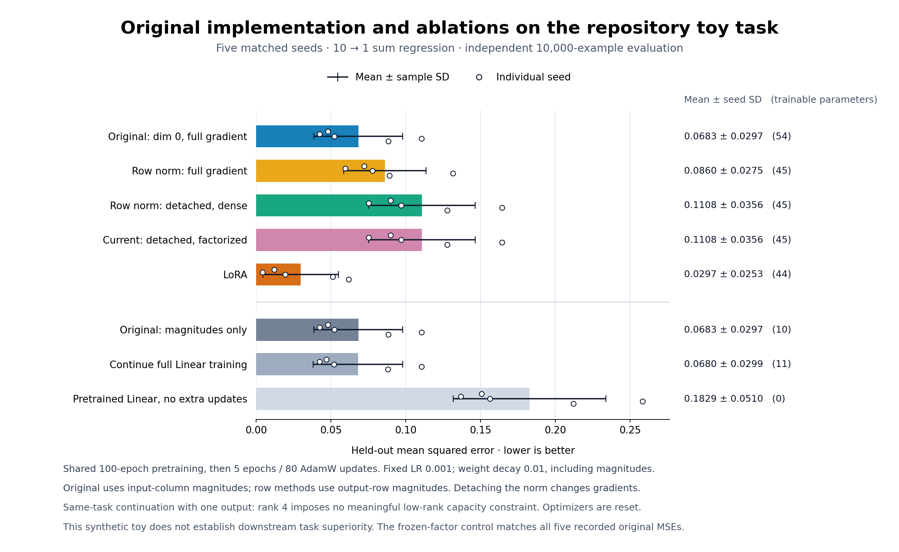

# Original implementation and DoRA ablation audit

This audit checks the original implementation at `bb97617a0d5e1ad4c6856cb7278f5a7386820d18`, separates normalization-axis and denominator-gradient changes, and measures their performance. The original performs better than the current implementation on this fixed toy configuration. That result does not establish downstream task superiority.



The chart uses all 35 saved runs in [toy_comparison.json](toy_comparison.json). Bars show mean held-out MSE, whiskers show sample standard deviation, and dots show individual seeds. Lower is better. [toy_chart_summary.json](toy_chart_summary.json) contains the recomputed chart values.

The five seeds share a pretrained `Linear(10, 1)` within each seed, then receive five additional epochs / 80 AdamW updates. There are 1,000 training and 10,000 independent held-out examples, with `y = sum(x)`. This is same-task continuation, with fixed untuned learning rate `0.001` and weight decay `0.01`, including magnitudes. With one output, rank 4 imposes no meaningful low-rank capacity restriction. The full-Linear control resets its optimizer for the additional updates.

| Variant | Normalization / gradient rule | Trainable parameters in toy |
|:--|:--|--:|
| Original | `dim=0`, full denominator gradient | 54 |
| Row, full gradient | `dim=1`, full denominator gradient | 45 |
| Row, detached dense | `dim=1`, detached denominator | 45 |
| Current factorized | `dim=1`, detached denominator, factorized activation path | 45 |
| LoRA | Additive low-rank update | 44 |
| Original magnitudes only | Original column normalization, frozen factors | 10 |
| Continue full Linear training | Train weight and bias | 11 |
| Pretrained reference | No additional updates | 0 |

The original and frozen-factor control give identical recorded held-out MSE for every seed. The original factors have tiny nonzero numerical gradients and recorded movement; this is not a claim that they never update. The detached dense and current factorized variants have nearly identical toy results. Detaching the denominator changes the gradient rule; it is a documented memory-saving variant, not a correction of an invalid full-gradient formula.

For PyTorch weights stored as `[out, in]`, the authors' implementation and PEFT normalize with `dim=1`. The paper's use of the word “column” follows its own matrix notation. [primary_source_audit.json](primary_source_audit.json) records the pinned author-code URL, paper URL, source hashes and relevant line references. The full paper, author implementation and third-party PEFT source files are omitted from this package; their hashes are provenance rather than locally reverified payloads.

## Evidence and limits

- [original_dora.py](original_dora.py) is the exact original repository source. [original_demo_stdout.txt](original_demo_stdout.txt) records its unmodified demo output: evaluation loss `0.1341557354` before adaptation and `0.0608030632` afterward. That demo evaluates a sampled training batch; its losses are separate from the chart's held-out experiment.
- [toy_compare.py](toy_compare.py), [toy_comparison.json](toy_comparison.json) and [toy_comparison_stdout.txt](toy_comparison_stdout.txt) preserve the executed toy script, individual seeds, initial gradients, parameter movements and output. No learning-rate selection was performed.
- [gpu_latency.py](gpu_latency.py), [gpu_latency.json](gpu_latency.json), [gpu_latency_validation.json](gpu_latency_validation.json) and [gpu_latency_stdout.txt](gpu_latency_stdout.txt) preserve the GPU microbenchmark and audit. It used GPU 1, FP32 without TF32, rank 8, shared weights/bias/factors with a nonzero update, 10 warmup calls, and seven samples of 20 calls. Backward includes input gradients. Memory is peak incremental allocated memory above resident model/input tensors, without optimizer state. The original was constructed on CPU and then moved whole to GPU; its forward was unchanged. The current version is slower at width 1,024, while saving memory; it is faster at width 4,096. Different normalization and gradient rules prevent interpreting the original/current timing ratio as factorization alone.
- [peft_parity.py](peft_parity.py) and [peft_parity.json](peft_parity.json) preserve actual forward/backward parity against installed PEFT `0.21.2`: one nonsquare CPU FP64 case with nonzero factors and rescaled magnitudes. This checks the detached-denominator variant. It does not establish low-precision identity or better task accuracy.
- [gpu_source](gpu_source) retains exact benchmark/current/original source snapshots and the original source with only its two `dim=0` occurrences changed to `dim=1`. All executed scripts are copied byte for byte. Stdout logs use `.txt` filenames to avoid repository log-ignore rules; their bytes are unchanged.

## Rebuild the chart and verify the package

From this directory:

```bash
python report.py --verify-only
python report.py --output-dir /tmp/dora-baseline-chart
```

Verification uses the Python standard library. Plotting also requires Matplotlib; the recorded chart was generated with Python 3.12.3 and Matplotlib 3.10.9. The report recomputes all toy means/SDs and GPU timing medians, verifies bundled source hashes and all files in [manifest.json](manifest.json), and checks the saved PEFT result. It does not rerun training, GPU inference or third-party source inspection. Running from another working directory works because input paths are resolved relative to `report.py`.

The manifest covers every packaged file except itself and records the historical origin and hash of every copied artifact. It distinguishes omitted third-party sources from bundled sources. Raw JSON and executed script bytes have not been rewritten to change their original paths.

## Historical commands and paths

The original runs used PyTorch `2.12.0+cu130`, Python 3.12.3, and, for the parity check, PEFT `0.21.2`. The experiment environment is pinned in the repository's [requirements-experiments.txt](../../requirements-experiments.txt).

```bash
CUDA_VISIBLE_DEVICES='' /var/tmp/dora-bench/venv/bin/python /var/tmp/dora-bench/baseline_audit/toy_compare.py
CUDA_VISIBLE_DEVICES=1 /var/tmp/dora-bench/venv/bin/python /var/tmp/dora-bench/baseline_audit/gpu_latency.py
CUDA_VISIBLE_DEVICES='' /var/tmp/dora-bench/venv/bin/python /var/tmp/dora-bench/baseline_audit/peft_parity.py
CUDA_VISIBLE_DEVICES='' /var/tmp/dora-bench/venv/bin/python /var/tmp/dora-bench/baseline_audit/original_dora.py
```

Paths under `/var/tmp/dora-bench` and `/home/catid/dora` in raw evidence describe the historical environment. Chart reconstruction does not need those paths. The executed toy script hardcodes its original artifact and repository roots; rerunning that training elsewhere requires adjusting those two paths in a separate working copy. The GPU script already resolves its snapshots relative to itself but writes new results beside itself, so copy this directory to a scratch location before rerunning. PEFT supports explicit paths, for example `python peft_parity.py --repo gpu_source --output /tmp/peft_parity_rerun.json`. Preserve this evidence directory when rerunning experiments.
